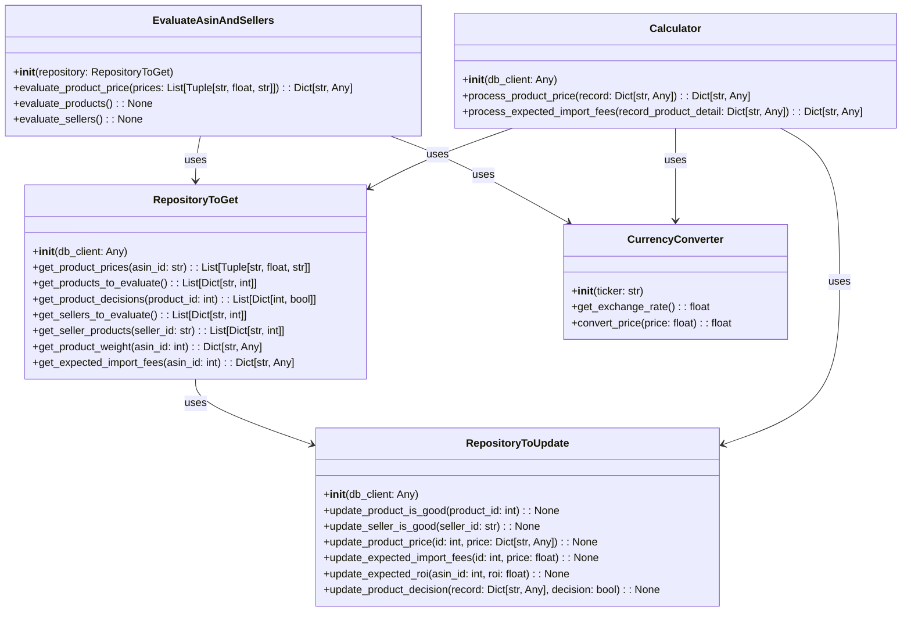

```mermaid
classDiagram
    class RepositoryToGet {
        +__init__(db_client: Any)
        +get_product_prices(asin_id: str): List[Tuple[str, float, str]]
        +get_products_to_evaluate(): List[Dict[str, int]]
        +get_product_decisions(product_id: int): List[Dict[int, bool]]
        +get_sellers_to_evaluate(): List[Dict[str, int]]
        +get_seller_products(seller_id: str): List[Dict[str, int]]
        +get_product_weight(asin_id: int): Dict[str, Any]
        +get_expected_import_fees(asin_id: int): Dict[str, Any]
    }

    class RepositoryToUpdate {
        +__init__(db_client: Any)
        +update_product_is_good(product_id: int): None
        +update_seller_is_good(seller_id: str): None
        +update_product_price(id: int, price: Dict[str, Any]): None
        +update_expected_import_fees(id: int, price: float): None
        +update_expected_roi(asin_id: int, roi: float): None
        +update_product_decision(record: Dict[str, Any], decision: bool): None
    }

    class EvaluateAsinAndSellers {
        +__init__(repository: RepositoryToGet)
        +evaluate_product_price(prices: List[Tuple[str, float, str]]): Dict[str, Any]
        +evaluate_products(): None
        +evaluate_sellers(): None
    }

    class CurrencyConverter {
        +__init__(ticker: str)
        +get_exchange_rate(): float
        +convert_price(price: float): float
    }

    class Calculator {
        +__init__(db_client: Any)
        +process_product_price(record: Dict[str, Any]): Dict[str, Any]
        +process_expected_import_fees(record_product_detail: Dict[str, Any]): Dict[str, Any]
    }

    RepositoryToGet --> RepositoryToUpdate : uses
    EvaluateAsinAndSellers --> RepositoryToGet : uses
    Calculator --> RepositoryToGet : uses
    Calculator --> RepositoryToUpdate : uses
    EvaluateAsinAndSellers --> CurrencyConverter : uses
    Calculator --> CurrencyConverter : uses
```