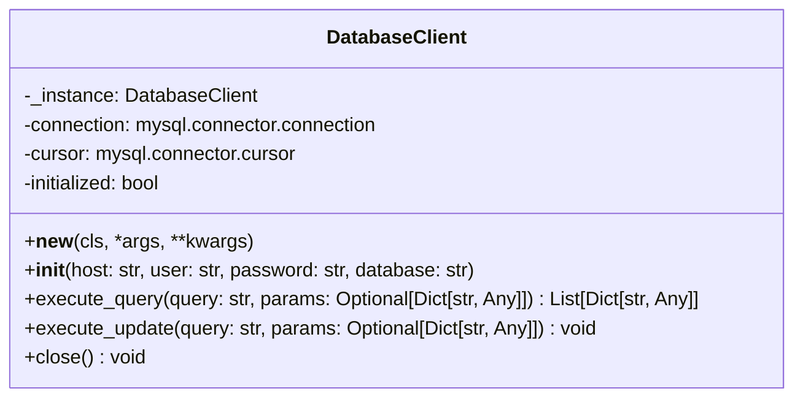

```mermaid
classDiagram
    class DatabaseClient {
        -_instance: DatabaseClient
        -connection: mysql.connector.connection
        -cursor: mysql.connector.cursor
        -initialized: bool
        +__new__(cls, *args, **kwargs)
        +__init__(host: str, user: str, password: str, database: str)
        +execute_query(query: str, params: Optional[Dict[str, Any]]) List[Dict[str, Any]]
        +execute_update(query: str, params: Optional[Dict[str, Any]]) void
        +close() void
    }
```