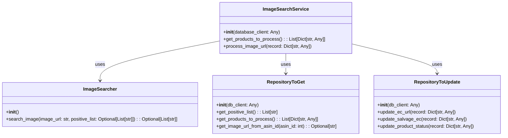

```mermaid
classDiagram
    class ImageSearcher {
        +__init__()
        +search_image(image_url: str, positive_list: Optional[List[str]]): Optional[List[str]]
    }

    class RepositoryToGet {
        +__init__(db_client: Any)
        +get_positive_list(): List[str]
        +get_products_to_process(): List[Dict[str, Any]]
        +get_image_url_from_asin_id(asin_id: int): Optional[str]
    }

    class RepositoryToUpdate {
        +__init__(db_client: Any)
        +update_ec_url(record: Dict[str, Any])
        +update_salvage_ec(record: Dict[str, Any])
        +update_product_status(record: Dict[str, Any])
    }

    class ImageSearchService {
        +__init__(database_client: Any)
        +get_products_to_process(): List[Dict[str, Any]]
        +process_image_url(record: Dict[str, Any])
    }

    ImageSearchService --> ImageSearcher : uses
    ImageSearchService --> RepositoryToGet : uses
    ImageSearchService --> RepositoryToUpdate : uses
```