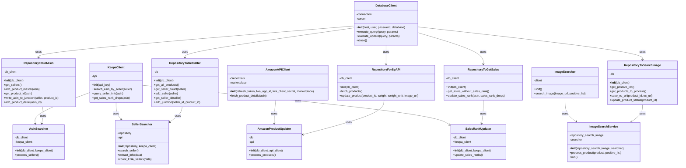

```mermaid
classDiagram
    class DatabaseClient {
        -connection
        -cursor
        +__init__(host, user, password, database)
        +execute_query(query, params)
        +execute_update(query, params)
        +close()
    }

    class RepositoryToGetAsin {
        -db_client
        +__init__(db_client)
        +get_sellers()
        +add_product_master(asin)
        +get_product_id(asin)
        +write_asin_to_junction(seller, product_id)
        +add_product_detail(asin_id)
    }

    class RepositoryForSpAPI {
        -db_client
        +__init__(db_client)
        +fetch_products()
        +update_product(product_id, weight, weight_unit, image_url)
    }

    class RepositoryToGetSeller {
        -db
        +__init__(db_client)
        +get_all_products()
        +get_seller_count(seller)
        +add_seller(seller)
        +get_seller_id(seller)
        +add_junction(seller_id, product_id)
    }

    class RepositoryToSearchImage {
        -db
        +__init__(db_client)
        +get_positive_list()
        +get_products_to_process()
        +save_ec_url(product_id, ec_url)
        +update_product_status(product_id)
    }

    class RepositoryToGetSales {
        -db_client
        +__init__(db_client)
        +get_asins_without_sales_rank()
        +update_sales_rank(asin, sales_rank_drops)
    }

    class KeepaClient {
        -api
        +__init__(api_key)
        +search_asin_by_seller(seller)
        +query_seller_info(asin)
        +get_sales_rank_drops(asin)
    }

    class AmazonAPIClient {
        -credentials
        -marketplace
        +__init__(refresh_token, lwa_app_id, lwa_client_secret, marketplace)
        +fetch_product_details(asin)
    }

    class ImageSearcher {
        -client
        +__init__()
        +search_image(image_url, positive_list)
    }

    class AsinSearcher {
        -db_client
        -keepa_client
        +__init__(db_client, keepa_client)
        +process_sellers()
    }

    class AmazonProductUpdater {
        -db
        -api
        +__init__(db_client, api_client)
        +process_products()
    }

    class SellerSearcher {
        -repository
        -api
        +__init__(repository, keepa_client)
        +search_seller()
        +extract_info(data)
        +count_FBA_sellers(data)
    }

    class ImageSearchService {
        -repository_search_image
        -searcher
        +__init__(repository_search_image, searcher)
        +process_product(product, positive_list)
        +run()
    }

    class SalesRankUpdater {
        -db_client
        +keepa_client
        +__init__(db_client, keepa_client)
        +update_sales_ranks()
    }

    DatabaseClient --> RepositoryToGetAsin : uses
    RepositoryToGetAsin --> AsinSearcher : uses
    KeepaClient --> AsinSearcher : uses
    DatabaseClient --> RepositoryForSpAPI : uses
    RepositoryForSpAPI --> AmazonProductUpdater : uses
    AmazonAPIClient --> AmazonProductUpdater : uses
    DatabaseClient --> RepositoryToGetSeller : uses
    RepositoryToGetSeller --> SellerSearcher : uses
    KeepaClient --> SellerSearcher : uses
    DatabaseClient --> RepositoryToSearchImage : uses
    RepositoryToSearchImage --> ImageSearchService : uses
    ImageSearcher --> ImageSearchService : uses
    DatabaseClient --> RepositoryToGetSales : uses
    RepositoryToGetSales --> SalesRankUpdater : uses
    KeepaClient --> SalesRankUpdater : uses


```