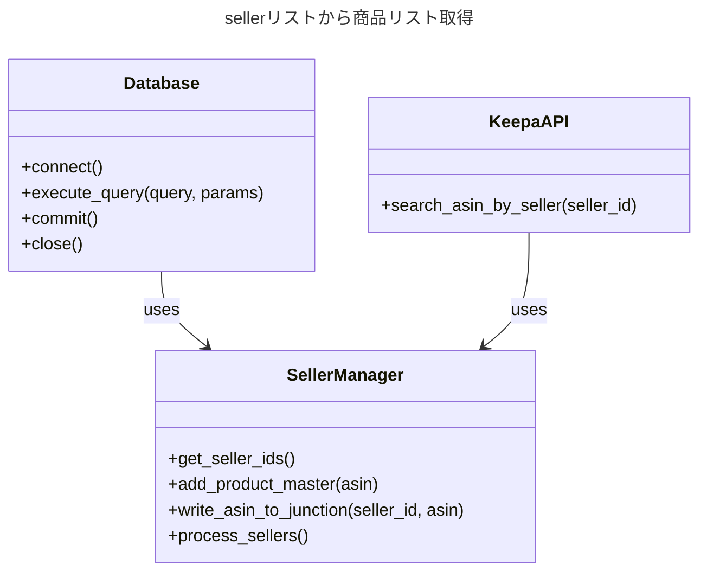

```mermaid
---
title: 'sellerリストから商品リスト取得'
---
classDiagram
    class Database {
        +connect()
        +execute_query(query, params)
        +commit()
        +close()
    }

    class KeepaAPI {
        +search_asin_by_seller(seller_id)
    }

    class SellerManager {
        +get_seller_ids()
        +add_product_master(asin)
        +write_asin_to_junction(seller_id, asin)
        +process_sellers()
    }

    Database --> SellerManager : uses
    KeepaAPI --> SellerManager : uses

```