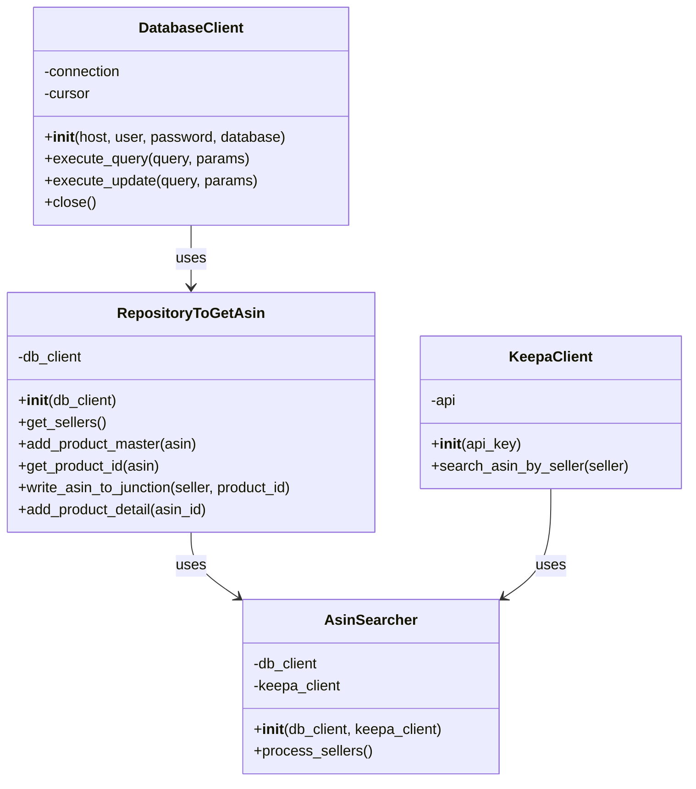

```mermaid
classDiagram
    class DatabaseClient {
        -connection
        -cursor
        +__init__(host, user, password, database)
        +execute_query(query, params)
        +execute_update(query, params)
        +close()
    }

    class RepositoryToGetAsin {
        -db_client
        +__init__(db_client)
        +get_sellers()
        +add_product_master(asin)
        +get_product_id(asin)
        +write_asin_to_junction(seller, product_id)
        +add_product_detail(asin_id)
    }

    class KeepaClient {
        -api
        +__init__(api_key)
        +search_asin_by_seller(seller)
    }

    class AsinSearcher {
        -db_client
        -keepa_client
        +__init__(db_client, keepa_client)
        +process_sellers()
    }

    DatabaseClient --> RepositoryToGetAsin : uses
    RepositoryToGetAsin --> AsinSearcher : uses
    KeepaClient --> AsinSearcher : uses


```