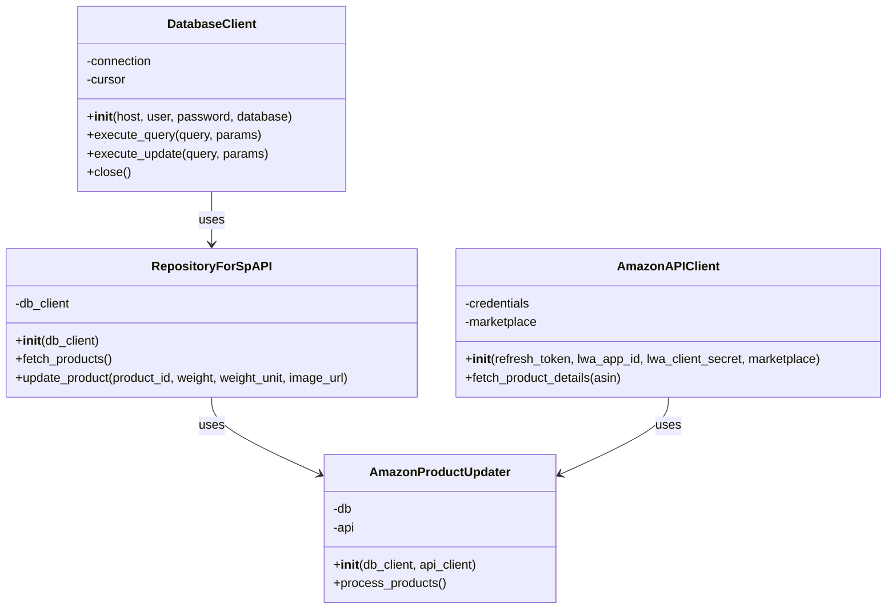

```mermaid
classDiagram
    class DatabaseClient {
        -connection
        -cursor
        +__init__(host, user, password, database)
        +execute_query(query, params)
        +execute_update(query, params)
        +close()
    }

    class RepositoryForSpAPI {
        -db_client
        +__init__(db_client)
        +fetch_products()
        +update_product(product_id, weight, weight_unit, image_url)
    }

    class AmazonAPIClient {
        -credentials
        -marketplace
        +__init__(refresh_token, lwa_app_id, lwa_client_secret, marketplace)
        +fetch_product_details(asin)
    }

    class AmazonProductUpdater {
        -db
        -api
        +__init__(db_client, api_client)
        +process_products()
    }

    DatabaseClient --> RepositoryForSpAPI : uses
    RepositoryForSpAPI --> AmazonProductUpdater : uses
    AmazonAPIClient --> AmazonProductUpdater : uses

```