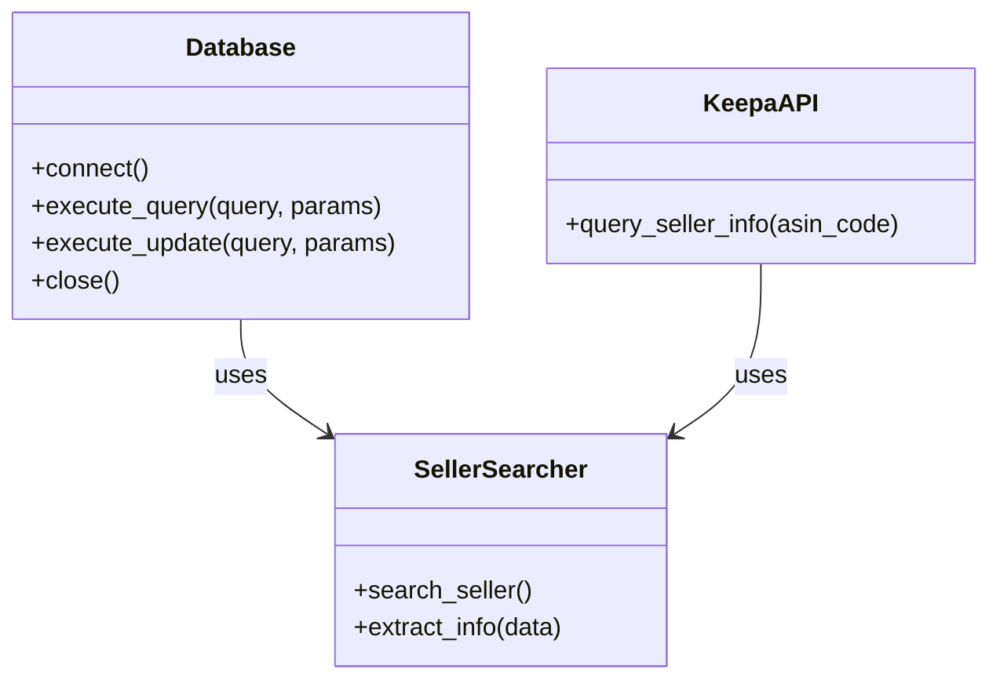

```mermaid

classDiagram
    class Database {
        +connect()
        +execute_query(query, params)
        +execute_update(query, params)
        +close()
    }

    class KeepaAPI {
        +query_seller_info(asin_code)
    }

    class SellerSearcher {
        +search_seller()
        +extract_info(data)
    }

    Database --> SellerSearcher : uses
    KeepaAPI --> SellerSearcher : uses

```