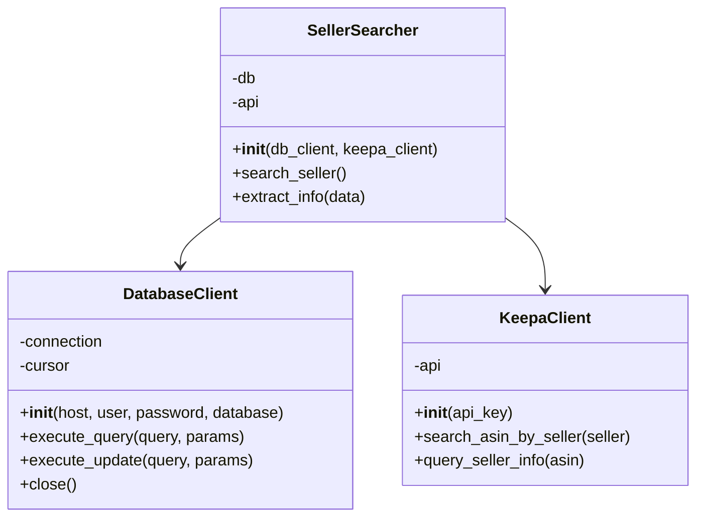

```mermaid

classDiagram
    class DatabaseClient {
        -connection
        -cursor
        +__init__(host, user, password, database)
        +execute_query(query, params)
        +execute_update(query, params)
        +close()
    }

    class KeepaClient {
        -api
        +__init__(api_key)
        +search_asin_by_seller(seller)
        +query_seller_info(asin)
    }

    class SellerSearcher {
        -db
        -api
        +__init__(db_client, keepa_client)
        +search_seller()
        +extract_info(data)
    }

    SellerSearcher --> DatabaseClient
    SellerSearcher --> KeepaClient


```