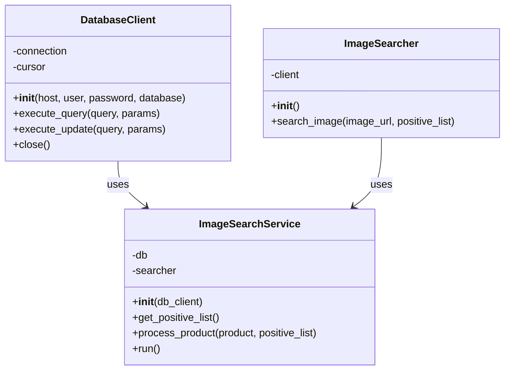

```mermaid
classDiagram
    class DatabaseClient {
        -connection
        -cursor
        +__init__(host, user, password, database)
        +execute_query(query, params)
        +execute_update(query, params)
        +close()
    }

    class ImageSearcher {
        -client
        +__init__()
        +search_image(image_url, positive_list)
    }

    class ImageSearchService {
        -db
        -searcher
        +__init__(db_client)
        +get_positive_list()
        +process_product(product, positive_list)
        +run()
    }

    DatabaseClient --> ImageSearchService : uses
    ImageSearcher --> ImageSearchService : uses

```