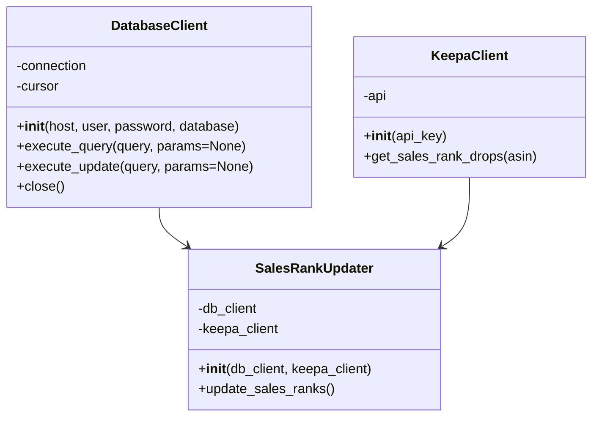

```mermaid

classDiagram
    class DatabaseClient {
        -connection
        -cursor
        +__init__(host, user, password, database)
        +execute_query(query, params=None)
        +execute_update(query, params=None)
        +close()
    }

    class KeepaClient {
        -api
        +__init__(api_key)
        +get_sales_rank_drops(asin)
    }

    class SalesRankUpdater {
        -db_client
        -keepa_client
        +__init__(db_client, keepa_client)
        +update_sales_ranks()
    }

    DatabaseClient --> SalesRankUpdater
    KeepaClient --> SalesRankUpdater

```