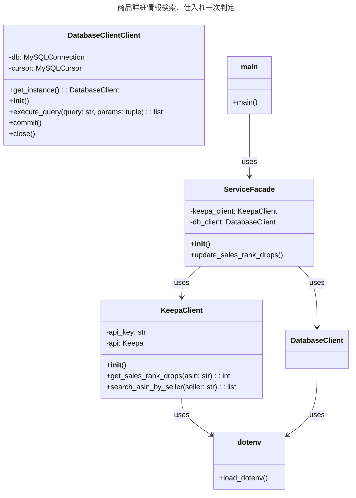

```mermaid
---
title: '商品詳細情報検索、仕入れ一次判定'
---
classDiagram
    class KeepaClient {
        -api_key: str
        -api: Keepa
        +__init__()
        +get_sales_rank_drops(asin: str): int
        +search_asin_by_seller(seller: str): list
    }

    class DatabaseClientClient {
        -db: MySQLConnection
        -cursor: MySQLCursor
        +get_instance(): DatabaseClient
        +__init__()
        +execute_query(query: str, params: tuple): list
        +commit()
        +close()
    }

    class ServiceFacade {
        -keepa_client: KeepaClient
        -db_client: DatabaseClient
        +__init__()
        +update_sales_rank_drops()
    }

    class dotenv {
        +load_dotenv()
    }

    class main {
        +main()
    }

    KeepaClient --> dotenv : uses
    DatabaseClient --> dotenv : uses
    ServiceFacade --> KeepaClient : uses
    ServiceFacade --> DatabaseClient : uses
    main --> ServiceFacade : uses
```