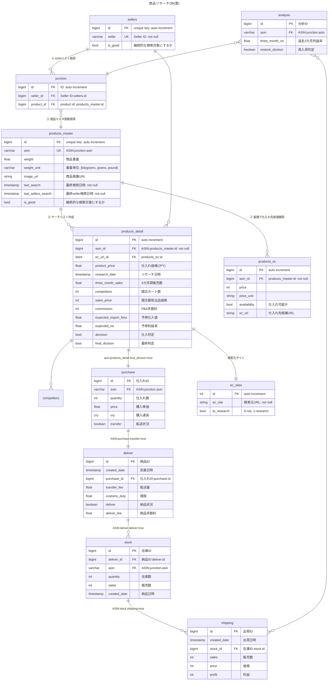

```mermaid

---
title: "商品リサーチDB(案)"
---
erDiagram
    sellers ||--o{ junction : "① ASINリスト取得"
    junction }o--|| products_master : "② 商品マスタ情報取得"
    products_detail }o--|| sellers : ""
    products_master ||--o{ products_detail : "④ サーチリスト作成"
    products_master ||--o{ products_ec : "③ 画像で仕入れ先候補検索"
    products_detail ||--o{ competitors : ""
    products_detail ||--|| purchase : "asin:products_detail.final_dicision=true"
    products_detail ||--|| ec_sites : "検索元サイト"
    purchase ||--|| deliver : "ASIN:purchase.transfer=true"
    deliver ||--o{ stock : "ASIN:deliver.deliver=true"
    stock ||--o{ shipping :"ASIN:stock.shipping=true"
    analysis }o--o{ shipping : ""
    analysis }o--|| junction :""


    sellers {
        bigint id PK "unique key: auto increment"
        varchar seller UK "Seller ID: not null"
        bool is_good "継続的な検索対象にするか"
    }

%% 検索時間に依存するdataを分離。productsとproducts_detailへ再編
    products_master { 
        bigint id PK "unique key: auto increment"
        varchar asin UK "ASIN:junction.asin"
        float weight "商品重量"
        varchar weight_unit "重量単位: [kilograms, grams, pound]"
        string image_url "商品画像URL"
        timestamp last_search "最終検索日時: not null"
        timestamp last_sellers_search "最終seller検索日時: not null"
        bool is_good "継続的な検索対象にするか"
    }

    junction {
        bigint id PK "ID: auto increment"
        bigint seller_id FK "Seller ID:sellers.id"
        bigint product_id FK "product id: products_master.id"
    }

    products_ec {
        bigint id PK "auto increment"
        bigint asin_id FK "products_master.id: not null"
        int price
        string price_unit
        bool availability "仕入れ可能か"
        string ec_url "仕入れ先候補URL"
    }

    ec_sites {
        int id PK "auto increment"
        string ec_site "検索元URL: not null"
        bool to_research "0-not, 1-research"
    }

    products_detail {
        bigint id PK "auto increment"
        bigint asin_id FK "ASIN:products_master.id: not null"
        bitint ec_url_id FK "products_ec.id"
        float product_price "仕入れ価格(JPY)"
        timestamp research_date "リサーチ日時"
        float three_month_sales "3カ月間販売数"
        int competitors "競合カート数"
        int sales_price "競合最低出品価格"
        int commission "FBA手数料"
        float expected_import_fees "予想仕入値"
        float expexted_roi "予想利益率"
        bool decision "仕入判定"
        bool final_dicision "最終判定"
    }

    purchase {
        bigint id PK "仕入れID"
        varchar asin FK "ASIN:junction.asin"
        int quantity "仕入れ数"
        float price "購入単価"
        cry cry "購入通貨"
        boolean transfer "転送状況"
    }

    deliver {
        bigint id PK "納品ID"
        timestamp created_date "到着日時"
        bigint purchase_id FK "仕入れID:purchase.id"
        float transfer_fee "転送量"
        float customs_duty "関税"
        boolean deliver "納品状況"
        float deliver_fee "納品手数料"
    }

    stock {
        bigint id PK "在庫ID"
        bigint deliver_id FK "納品ID:deliver.id"
        varchar asin FK "ASIN:junction.asin"
        int quantity "在庫数"
        int sales "販売数"
        timestamp created_date "納品日時"
    }

    shipping {
        bigint id PK "出荷ID"
        timestamp created_date "出荷日時"
        bigint stock_id FK "在庫ID:stock.id"
        int sales "販売数"
        int price "価格"
        int profit "利益"
    }

    analysis {
        bigint id PK "分析ID"
        varchar asin FK "ASIN:junction.asin"
        float three_month_roi "過去3カ月利益率"
        boolean restock_dicision "再入荷判定"
    }


```