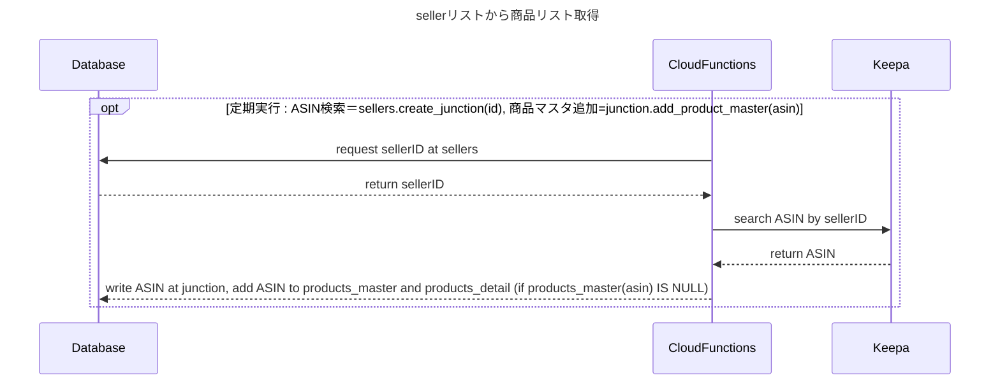

```mermaid
---
title: 'sellerリストから商品リスト取得'
---
sequenceDiagram
    participant db as Database
    participant cf as CloudFunctions
    participant keepa as Keepa

        opt 定期実行 : ASIN検索＝sellers.create_junction(id), 商品マスタ追加=junction.add_product_master(asin)
            cf ->> db : request sellerID at sellers
            db -->> cf : return sellerID
            cf ->> keepa : search ASIN by sellerID
            keepa -->> cf : return ASIN
            cf -->> db : write ASIN at junction, add ASIN to products_master and products_detail (if products_master(asin) IS NULL)
        end
```