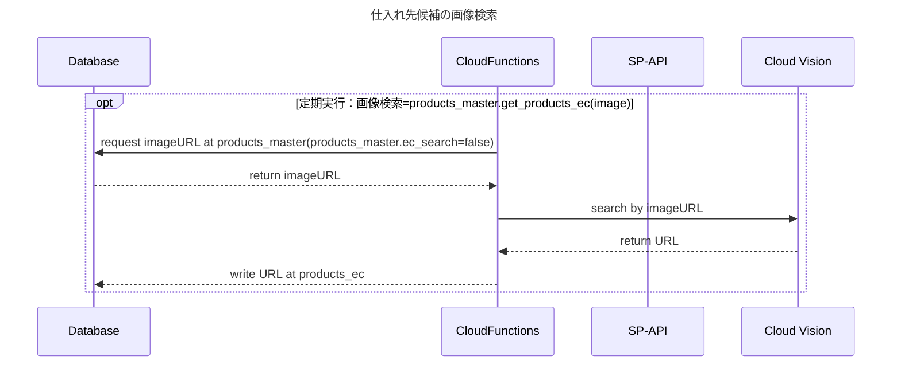

```mermaid
---
title: '仕入れ先候補の画像検索'
---
sequenceDiagram
    participant db as Database
    participant cf as CloudFunctions
    participant spapi as SP-API
    participant cvapi as Cloud Vision
        opt 定期実行：画像検索=products_master.get_products_ec(image)
            cf ->> db : request imageURL at products_master(products_master.ec_search=false)
            db -->> cf : return imageURL
            cf ->> cvapi : search by imageURL
            cvapi -->> cf : return URL
            cf -->> db : write URL at products_ec
        end
```