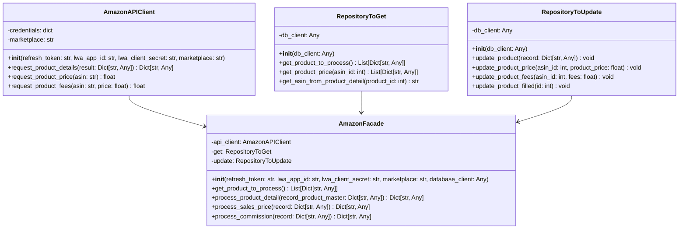

```mermaid

classDiagram
    class AmazonAPIClient {
        -credentials: dict
        -marketplace: str
        +__init__(refresh_token: str, lwa_app_id: str, lwa_client_secret: str, marketplace: str)
        +request_product_details(result: Dict[str, Any]) Dict[str, Any]
        +request_product_price(asin: str) float
        +request_product_fees(asin: str, price: float) float
    }

    class RepositoryToGet {
        -db_client: Any
        +__init__(db_client: Any)
        +get_product_to_process() List[Dict[str, Any]]
        +get_product_price(asin_id: int) List[Dict[str, Any]]
        +get_asin_from_product_detail(product_id: int) str
    }

    class RepositoryToUpdate {
        -db_client: Any
        +__init__(db_client: Any)
        +update_product(record: Dict[str, Any]) void
        +update_product_price(asin_id: int, product_price: float) void
        +update_product_fees(asin_id: int, fees: float) void
        +update_product_filled(id: int) void
    }

    class AmazonFacade {
        -api_client: AmazonAPIClient
        -get: RepositoryToGet
        -update: RepositoryToUpdate
        +__init__(refresh_token: str, lwa_app_id: str, lwa_client_secret: str, marketplace: str, database_client: Any)
        +get_product_to_process() List[Dict[str, Any]]
        +process_product_detail(record_product_master: Dict[str, Any]) Dict[str, Any]
        +process_sales_price(record: Dict[str, Any]) Dict[str, Any]
        +process_commission(record: Dict[str, Any]) Dict[str, Any]
    }

    AmazonAPIClient --> AmazonFacade
    RepositoryToGet --> AmazonFacade
    RepositoryToUpdate --> AmazonFacade
```