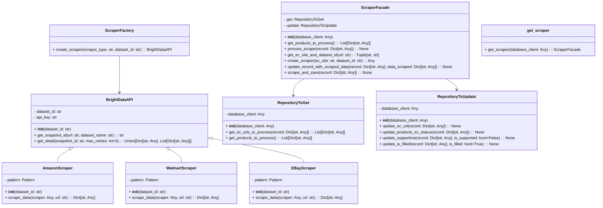

```mermaid
classDiagram
    class BrightDataAPI {
        - dataset_id: str
        - api_key: str
        + __init__(dataset_id: str)
        + get_snapshot_id(url: str, dataset_name: str): str
        + get_detail(snapshot_id: str, max_retries: int=5): Union[Dict[str, Any], List[Dict[str, Any]]]
    }

    class AmazonScraper {
        - pattern: Pattern
        + __init__(dataset_id: str)
        + scrape_data(scraper: Any, url: str): Dict[str, Any]
    }

    class WalmartScraper {
        - pattern: Pattern
        + __init__(dataset_id: str)
        + scrape_data(scraper: Any, url: str): Dict[str, Any]
    }

    class EBayScraper {
        - pattern: Pattern
        + __init__(dataset_id: str)
        + scrape_data(scraper: Any, url: str): Dict[str, Any]
    }

    class ScraperFactory {
        + create_scraper(scraper_type: str, dataset_id: str): BrightDataAPI
    }

    class RepositoryToGet {
        - database_client: Any
        + __init__(database_client: Any)
        + get_ec_urls_to_process(record: Dict[str, Any]): List[Dict[str, Any]]
        + get_products_to_process(): List[Dict[str, Any]]
    }

    class RepositoryToUpdate {
        - database_client: Any
        + __init__(database_client: Any)
        + update_ec_url(record: Dict[str, Any]): None
        + update_products_ec_status(record: Dict[str, Any]): None
        + update_supportive(record: Dict[str, Any], is_supported: bool=False): None
        + update_is_filled(record: Dict[str, Any], is_filled: bool=True): None
    }

    class ScraperFacade {
        - get: RepositoryToGet
        - update: RepositoryToUpdate
        + __init__(database_client: Any)
        + get_products_to_process(): List[Dict[str, Any]]
        + process_scrape(record: Dict[str, Any]): None
        + get_ec_site_and_dataset_id(url: str): Tuple[str, str]
        + create_scraper(ec_site: str, dataset_id: str): Any
        + update_record_with_scraped_data(record: Dict[str, Any], data_scraped: Dict[str, Any]): None
        + scrape_and_save(record: Dict[str, Any]): None
    }

    class get_scraper {
        + get_scraper(database_client: Any): ScraperFacade
    }

    BrightDataAPI <|-- AmazonScraper
    BrightDataAPI <|-- WalmartScraper
    BrightDataAPI <|-- EBayScraper
    ScraperFactory --> BrightDataAPI
    ScraperFacade --> RepositoryToGet
    ScraperFacade --> RepositoryToUpdate
```