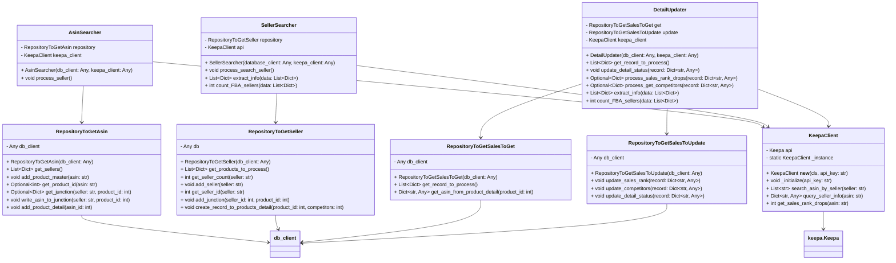

```mermaid
classDiagram
    class KeepaClient {
        - Keepa api
        - static KeepaClient _instance
        + KeepaClient __new__(cls, api_key: str)
        + void _initialize(api_key: str)
        + List~str~ search_asin_by_seller(seller: str)
        + Dict~str, Any~ query_seller_info(asin: str)
        + int get_sales_rank_drops(asin: str)
    }

    class RepositoryToGetAsin {
        - Any db_client
        + RepositoryToGetAsin(db_client: Any)
        + List~Dict~ get_sellers()
        + void add_product_master(asin: str)
        + Optional~int~ get_product_id(asin: str)
        + Optional~Dict~ get_junction(seller: str, product_id: int)
        + void write_asin_to_junction(seller: str, product_id: int)
        + void add_product_detail(asin_id: int)
    }

    class AsinSearcher {
        - RepositoryToGetAsin repository
        - KeepaClient keepa_client
        + AsinSearcher(db_client: Any, keepa_client: Any)
        + void process_seller()
    }

    class RepositoryToGetSeller {
        - Any db
        + RepositoryToGetSeller(db_client: Any)
        + List~Dict~ get_products_to_process()
        + int get_seller_count(seller: str)
        + void add_seller(seller: str)
        + int get_seller_id(seller: str)
        + void add_junction(seller_id: int, product_id: int)
        + void create_record_to_products_detail(product_id: int, competitors: int)
    }

    class SellerSearcher {
        - RepositoryToGetSeller repository
        - KeepaClient api
        + SellerSearcher(database_client: Any, keepa_client: Any)
        + void process_search_seller()
        + List~Dict~ extract_info(data: List~Dict~)
        + int count_FBA_sellers(data: List~Dict~)
    }

    class RepositoryToGetSalesToGet {
        - Any db_client
        + RepositoryToGetSalesToGet(db_client: Any)
        + List~Dict~ get_record_to_process()
        + Dict~str, Any~ get_asin_from_product_detail(product_id: int)
    }

    class RepositoryToGetSalesToUpdate {
        - Any db_client
        + RepositoryToGetSalesToUpdate(db_client: Any)
        + void update_sales_rank(record: Dict~str, Any~)
        + void update_competitors(record: Dict~str, Any~)
        + void update_detail_status(record: Dict~str, Any~)
    }

    class DetailUpdater {
        - RepositoryToGetSalesToGet get
        - RepositoryToGetSalesToUpdate update
        - KeepaClient keepa_client
        + DetailUpdater(db_client: Any, keepa_client: Any)
        + List~Dict~ get_record_to_process()
        + void update_detail_status(record: Dict~str, Any~)
        + Optional~Dict~ process_sales_rank_drops(record: Dict~str, Any~)
        + Optional~Dict~ process_get_competitors(record: Dict~str, Any~)
        + List~Dict~ extract_info(data: List~Dict~)
        + int count_FBA_sellers(data: List~Dict~)
    }

    KeepaClient --> keepa.Keepa
    RepositoryToGetAsin --> db_client
    AsinSearcher --> RepositoryToGetAsin
    AsinSearcher --> KeepaClient
    RepositoryToGetSeller --> db_client
    SellerSearcher --> RepositoryToGetSeller
    SellerSearcher --> KeepaClient
    RepositoryToGetSalesToGet --> db_client
    RepositoryToGetSalesToUpdate --> db_client
    DetailUpdater --> RepositoryToGetSalesToGet
    DetailUpdater --> RepositoryToGetSalesToUpdate
    DetailUpdater --> KeepaClient
```