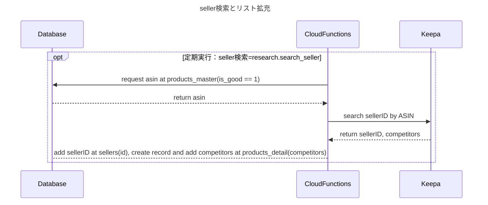

```mermaid
---
title: 'seller検索とリスト拡充'
---
sequenceDiagram
    participant db as Database
    participant cf as CloudFunctions
    participant keepa as Keepa

        opt 定期実行：seller検索=research.search_seller
            cf ->> db : request asin at products_master(is_good == 1)
            db -->> cf : return asin
            cf ->> keepa : search sellerID by ASIN
            keepa -->> cf : return sellerID, competitors
            cf --> db : add sellerID at sellers(id), create record and add competitors at products_detail(competitors)
        end

```