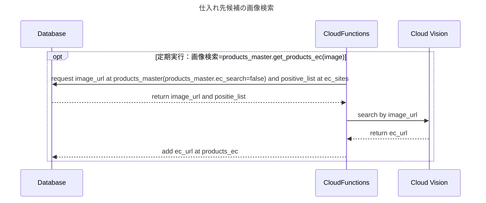

```mermaid
---
title: '仕入れ先候補の画像検索'
---
sequenceDiagram
    participant db as Database
    participant cf as CloudFunctions
    participant cvapi as Cloud Vision
        opt 定期実行：画像検索=products_master.get_products_ec(image)
            cf ->> db : request image_url at products_master(products_master.ec_search=false) and positive_list at ec_sites
            db -->> cf : return image_url and positie_list
            cf ->> cvapi : search by image_url
            cvapi -->> cf : return ec_url
            cf -->> db : add ec_url at products_ec
        end
```