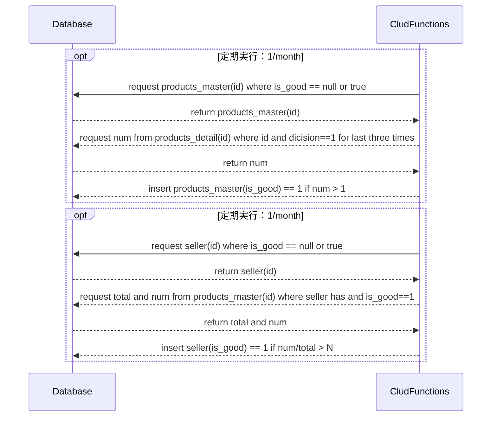

```mermaid
sequenceDiagram
    participant db as Database
    participant cf as CludFunctions

        opt 定期実行：1/month
            cf ->> db : request products_master(id) where is_good == null or true
            db -->> cf : return products_master(id)
            cf -->> db : request num from products_detail(id) where id and dicision==1 for last three times
            db -->> cf : return num
            cf -->> db : insert products_master(is_good) == 1 if num > 1
        end

        opt 定期実行：1/month
            cf ->> db : request seller(id) where is_good == null or true
            db -->> cf : return seller(id)
            cf -->> db : request total and num from products_master(id) where seller has and is_good==1
            db -->> cf : return total and num
            cf -->> db : insert seller(is_good) == 1 if num/total > N
        end
```